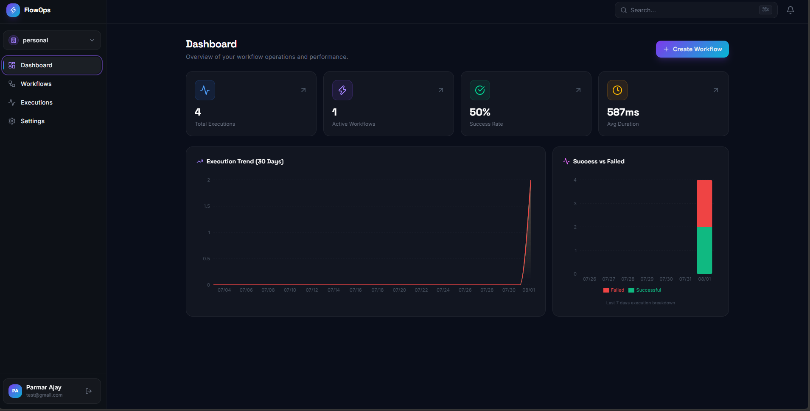
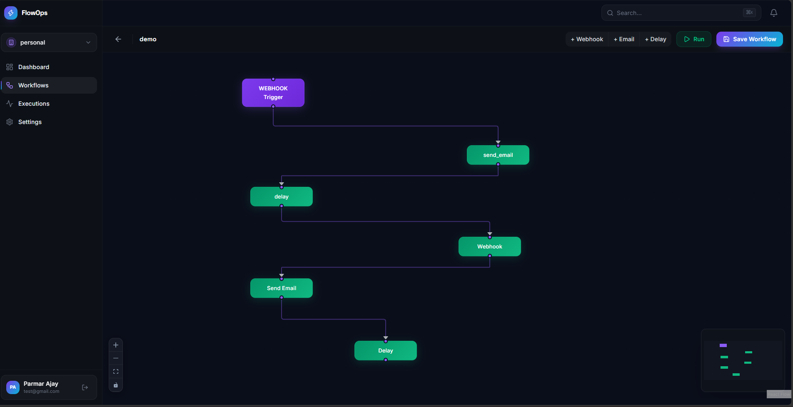

<div align="center">

# FlowOps — Multi-Tenant Workflow Automation & Operations Platform

[](https://git.io/typing-svg)

<br/>


<br/>

**[Overview](#overview)** &nbsp;·&nbsp; **[Architecture](#architecture)** &nbsp;·&nbsp; **[Tech Stack](#tech-stack)** &nbsp;·&nbsp; **[Getting Started](#getting-started)** &nbsp;·&nbsp; **[Report Bug](https://github.com/parmarajay2712/flowops/issues)**

</div>

---

## Table of Contents

| # | Section |
|---|---------|
| 1 | [Overview](#overview) |
| 2 | [Screenshots](#screenshots) |
| 3 | [Features](#features) |
| 4 | [Tech Stack](#tech-stack) |
| 5 | [Architecture](#architecture) |
| 6 | [Redis Usage](#redis-usage) |
| 7 | [Project Structure](#project-structure) |
| 8 | [Getting Started](#getting-started) |
| 9 | [Environment Variables](#environment-variables) |
| 10 | [Database Schema](#database-schema) |
| 11 | [Authentication and Security](#authentication-and-security) |
| 12 | [API Routes](#api-routes) |
| 13 | [Design System](#design-system) |
| 14 | [Deployment](#deployment) |
| 15 | [Roadmap](#roadmap) |
| 16 | [Contributing](#contributing) |
| 17 | [License](#license) |

---

## Overview

<div align="center">

```
================================================================================
   FlowOps is a multi-tenant workflow automation platform built with the
   MERN stack and Redis.

   - Visual drag-and-drop canvas for building automated workflows
   - Strict per-organization data isolation with role-based access control
   - Recursive execution engine with retries and full observability
   - Redis-backed idempotency so webhooks never double-fire
================================================================================
```

</div>

> **A self-serve automation platform for teams who are tired of writing one-off scripts for webhooks, cron jobs, and integrations.** Organizations sign up, invite teammates with scoped roles, and build workflows visually — trigger, conditions, actions — instead of shipping custom glue code for every integration.

### Why This Project?

| Common Pain Points | FlowOps |
|:----------------------|:-----------------|
| Custom scripts for every webhook/cron integration | Visual workflow builder — trigger, condition, action nodes |
| Shared backends risk cross-tenant data leaks | Every query scoped by `organizationId`, enforced in middleware |
| Ad-hoc permission checks scattered across routes | Centralized RBAC middleware (`OWNER` / `ADMIN` / `MEMBER` / `VIEWER`) |
| Webhooks fire twice, actions run twice | Redis-backed idempotency keys, 24-hour TTL |
| No visibility into why an automation failed | Full execution timeline — every step, payload, and error logged |
| Generic light-mode admin templates | Dark glassmorphism UI with a `Cmd+K` command palette |

### Built For

```
Engineering and DevOps teams tired of maintaining one-off integration scripts
RevOps / Ops teams who need to automate without writing code
B2B SaaS products that need an embeddable automation layer
Developers learning multi-tenant SaaS patterns, RBAC, and graph-based execution engines
```

---

## Screenshots

<div align="center">

**HomePage**

.png)

<br/>

**Dashboard**



<br/>

**Workflow Builder Canvas**



<br/>

**Execution Timeline**


<br/>

**Command Palette**


</div>

---

## Features

<details open>
<summary><h3>Multi-Tenant Architecture & Security</h3></summary>

| Feature | Where | How It Works |
|---------|-------|---------------|
| **Organization Isolation** | All routes | Custom `org.middleware.js` injects `organizationId` into every request; all Mongoose queries are scoped by it, so cross-tenant reads/writes aren't possible from the application layer |
| **Role-Based Access Control** | All mutating routes | Four roles per organization — `OWNER`, `ADMIN`, `MEMBER`, `VIEWER` — enforced by middleware before a controller runs |
| **JWT Authentication** | `/auth/*` | Stateless auth via signed JWTs; passwords hashed with `bcryptjs` before storage |
| **Multi-Org Membership** | `OrganizationMember` model | A user can belong to more than one organization, each with its own role |

</details>

<details>
<summary><h3>Workflow Builder Engine</h3></summary>

| Feature | Where | How It Works |
|---------|-------|---------------|
| **Visual Canvas** | Workflow editor | Built on React Flow — snap-to-grid, `Cmd+S` to save, dark-mode canvas |
| **Triggers** | Trigger node | Manual (from the UI) or programmatic (incoming webhook) |
| **Action Nodes** | Action nodes | `Delay`, `Email`, generic `Webhook` call, with more node types planned |
| **Webhook Idempotency** | Redis | Duplicate webhook deliveries within a 24-hour window are rejected before they reach the engine |

</details>

<details>
<summary><h3>Execution & Observability</h3></summary>

| Feature | Where | How It Works |
|---------|-------|---------------|
| **Recursive Execution Engine** | `services/actionEngine.js`, `services/conditionEngine.js` | Walks the workflow's action list, evaluates conditions, executes each action, retries failed steps up to `MAX_RETRIES` with backoff |
| **Execution Timeline** | Execution detail page | Every step, payload, response, and error is logged to the `WorkflowExecution` document |
| **Analytics Dashboard** | `/dashboard` | Recharts-powered totals, success rate, and a 30-day execution trend, aggregated from MongoDB |

</details>

<details>
<summary><h3>Interface</h3></summary>

| Feature | Implementation |
|---------|-----------------|
| **Dark Glassmorphism UI** | Tailwind CSS with a curated HSL palette and gradient accents |
| **Command Palette** | Global `Cmd+K` quick-action menu via `cmdk` |
| **Route-Based Code Splitting** | `React.lazy` + `Suspense` on the workflow builder route to keep the initial bundle small |
| **Server-State Management** | `@tanstack/react-query` for caching, refetch-on-focus, and optimistic updates |
| **Motion** | Framer Motion for page transitions and list animations |

</details>

---

## Tech Stack

<div align="center">

### Backend


### Frontend
-20232A?style=flat-square&logo=react&logoColor=61DAFB)


</div>

| Category | Package | Purpose |
|----------|---------|---------|
| **Server** | express | Core REST API framework — non-blocking I/O |
| **Database** | mongodb / mongoose | Flexible schemas for workflow `config` objects, which vary per action type |
| **Cache & Queue** | Upstash Redis | Webhook idempotency keys, cached active-workflow lookups, rate limiting |
| **Validation** | zod | Runtime validation on every request body — malformed payloads never reach the database |
| **Auth** | jsonwebtoken, bcryptjs | Stateless JWT auth, salted password hashing |
| **Testing** | vitest, supertest | Unit tests for engine logic, integration tests for API routes |
| **Frontend build** | vite | Fast dev server and HMR |
| **Canvas** | @xyflow/react (React Flow) | Node-based drag-and-drop workflow builder |
| **Server state** | @tanstack/react-query | Caching, refetching, optimistic updates |
| **Charts** | recharts | Analytics dashboard visualizations |
| **Command menu** | cmdk | `Cmd+K` global command palette |

---

## Architecture

```
                    +-------------------------------+
                    |         React Frontend         |
                    |   Vite - React Flow Canvas     |
                    +---------------+-----------------+
                                    |  REST API + JWT
                +-------------------v-------------------+
                |            Express Server               |
                |   Auth Middleware - Org Middleware       |
                |          RBAC Middleware                 |
                +------+--------------------+-------------+
                       |                    |
        +--------------v--+      +----------v-------------+
        |    MongoDB       |      |    Upstash Redis        |
        |  (via Mongoose)  |      |  Idempotency - Caching  |
        |  User, Org,      |      |  Rate limiting          |
        |  Workflow, ...   |      +-------------------------+
        +------------------+
```

### Data Flow Example: Triggering a Workflow

```
  +----------+    +----------------+    +------------------+    +-----------+
  |  Client  |--->|  POST          |--->|  Attach JWT +     |--->|  Express  |
  |  clicks  |    |  /workflows/   |    |  x-organization-id|    |  router   |
  |  Run     |    |  :id/trigger   |    |  headers          |    |  matches  |
  +----------+    +----------------+    +------------------+    +-----+-----+
                                                                       |
       +---------------------------------------------------------------v---+
       |  requireAuth -> requireOrgAccess (checks OrganizationMember role)  |
       +---------------------------------------------------------------+---+
                                                                       |
       +---------------------------------------------------------------v---+
       |  conditionEngine validates rules, actionEngine walks the action    |
       |  list, retries failed steps (MAX_RETRIES, backoff)                 |
       +---------------------------------------------------------------+---+
                                                                       |
       +---------------------------------------------------------------v---+
       |  WorkflowExecution saved (status, durationMs, step timeline) -->   |
       |  React Query invalidates ['executions'], UI updates instantly      |
       +-----------------------------------------------------------------+
```

---

## Redis Usage

**Why Redis?** MongoDB is disk-based; Redis gives sub-millisecond in-memory lookups for the two things on the hot path that can't afford a database round trip.

1. **Webhook idempotency** — `workflows:webhook:idempotency:{signature}`
   Incoming webhook payloads are hashed and stored with `SET EX 86400 NX`. If the key already exists, the request is a duplicate and is rejected before it reaches the engine.

2. **Active workflow caching** — `workflows:{orgId}`
   The engine looks up an organization's active workflows on every trigger event. Results are cached and explicitly invalidated (`redisClient.del()`) whenever a workflow is created, updated, or deleted.

```js
// Idempotency check, simplified
const key = `workflows:webhook:idempotency:${signatureHash}`;
const isNew = await redis.set(key, "1", { EX: 86400, NX: true });
if (!isNew) return res.status(409).json({ error: "Duplicate webhook delivery" });
```

---

## Project Structure

```
flowops/
|-- backend/
|   |-- src/
|   |   |-- config/              # env.js, db.js
|   |   |-- controllers/         # auth, execution, workflow
|   |   |-- middlewares/         # auth, org, rbac, errorHandler
|   |   |-- models/              # User, Organization, Workflow, WorkflowExecution
|   |   |-- routes/              # API route definitions
|   |   |-- services/            # actionEngine, conditionEngine, redis
|   |   |-- tests/                # Vitest integration tests
|   |   +-- server.js            # Express app entry point
|   +-- package.json
+-- frontend/
    |-- src/
    |   |-- components/          # CommandPalette, shared UI
    |   |-- contexts/            # AuthContext
    |   |-- layouts/             # DashboardLayout, AuthLayout
    |   |-- lib/                 # axios client config
    |   |-- pages/               # Login, Register, Dashboard, Workflows, Settings
    |   |-- App.jsx              # Router config, lazy loading
    |   +-- main.jsx             # React DOM mount
    +-- package.json
```

---

## Getting Started

### Prerequisites

```bash
node        >= 18.0.0
npm / pnpm
MongoDB URI  - local or Atlas
Upstash Redis REST URL and Token
```

### Installation

```bash
# 1. Clone the repository
git clone https://github.com/parmarajay2712/flowops.git
cd flowops

# 2. Backend setup
cd backend
npm install
cp .env.example .env   # fill in your values, see below
npm run dev

# 3. Frontend setup (in a new terminal)
cd frontend
npm install
cp .env.example .env
npm run dev

# 4. Run tests
cd backend
npm test
```

The frontend runs at [http://localhost:5173](http://localhost:5173), the API at `http://localhost:5000`.

---

## Environment Variables

**Backend (`backend/.env`)**

```env
PORT=5000
MONGODB_URI=your_mongodb_connection_string
JWT_SECRET=your_super_secret_jwt_key
JWT_EXPIRES_IN=7d
UPSTASH_REDIS_REST_URL=your_upstash_url
UPSTASH_REDIS_REST_TOKEN=your_upstash_token
```

**Frontend (`frontend/.env`)**

```env
VITE_API_URL=http://localhost:5000/api/v1
```

| Variable | Required | Purpose |
|----------|:--------:|---------|
| `MONGODB_URI` | Yes | Database connection string |
| `JWT_SECRET` | Yes | Signs and verifies auth tokens |
| `JWT_EXPIRES_IN` | Yes | Token lifetime (default `7d`) |
| `UPSTASH_REDIS_REST_URL` / `_TOKEN` | Yes | REST-based Redis client (serverless-friendly, no persistent TCP connection needed) |
| `VITE_API_URL` | Yes | Base URL the frontend calls |

> **Never commit your `.env` file.** Use `.env.example` as the template only.

---

## Database Schema

All models are defined with Mongoose in `backend/src/models/`.

<details open>
<summary><strong>User</strong></summary>

| Field | Type | Description |
|-------|------|-------------|
| `email` | String, unique | Login identity |
| `passwordHash` | String | bcrypt hash, never the raw password |
| `name` | String | Display name |
| `isActive` | Boolean | Account status |

</details>

<details>
<summary><strong>Organization</strong></summary>

| Field | Type | Description |
|-------|------|-------------|
| `name` | String | Organization display name |
| `slug` | String, unique | URL-friendly identifier |
| `ownerId` | ObjectId → User | Organization owner |
| `features` | Mixed | Feature-flag style config |

</details>

<details>
<summary><strong>OrganizationMember</strong></summary>

| Field | Type | Description |
|-------|------|-------------|
| `organizationId` | ObjectId → Organization | |
| `userId` | ObjectId → User | |
| `role` | String enum | `OWNER` \| `ADMIN` \| `MEMBER` \| `VIEWER` |

**Index:** compound unique index on `{ organizationId, userId }` — lets a user belong to multiple orgs, one role each.

</details>

<details>
<summary><strong>Workflow</strong></summary>

| Field | Type | Description |
|-------|------|-------------|
| `organizationId` | ObjectId → Organization | Tenant scope |
| `name` | String | Workflow name |
| `trigger` | { type, config: Mixed } | Manual or webhook |
| `actions` | [{ id, type, config: Mixed }] | Ordered action list |
| `status` | String | Active / paused |

**Index:** `{ organizationId: 1, status: 1 }`

</details>

<details>
<summary><strong>WorkflowExecution</strong></summary>

| Field | Type | Description |
|-------|------|-------------|
| `workflowId` | ObjectId → Workflow | |
| `organizationId` | ObjectId → Organization | Tenant scope |
| `status` | String | `SUCCESS` \| `FAILED` |
| `durationMs` | Number | Execution time |
| `steps` | [Mixed] | Per-step logs — payload, response, error |
| `triggerPayload` | Mixed | The payload that started this run |

**Index:** `{ organizationId: 1, createdAt: -1 }` — keeps the dashboard's "last 50 executions" query fast without scanning the collection.

</details>

---

## Authentication and Security

### Route Protection — 3 Layers

| Layer | Enforces |
|-------|----------|
| 1. `requireAuth` | Valid, unexpired JWT present |
| 2. `requireOrgAccess` | User is a member of the organization in `x-organization-id` |
| 3. RBAC check | User's role is permitted for this specific action (e.g., only `OWNER`/`ADMIN` can view audit logs or issue API keys) |

### Security Notes

- Every controller scopes its MongoDB queries by `req.organizationId` — the isolation boundary lives at the query layer, not just the UI
- Zod validates every request body before it reaches a controller
- Passwords are hashed with `bcryptjs`; raw passwords are never stored or logged

---

## API Routes

| Method | Endpoint | Auth | Description |
|:------:|----------|:----:|-------------|
| POST | `/api/v1/auth/register` | No | Create account |
| POST | `/api/v1/auth/login` | No | Issue JWT |
| GET | `/api/v1/organizations` | Yes | List orgs the user belongs to |
| POST | `/api/v1/organizations` | Yes | Create an organization |
| GET | `/api/v1/organizations/:id/members` | Yes (Admin+) | List members and roles |
| GET | `/api/v1/workflows` | Yes | List workflows for the active org |
| POST | `/api/v1/workflows` | Yes (Member+) | Create a workflow |
| POST | `/api/v1/workflows/:id/trigger` | Yes | Manually trigger a run |
| GET | `/api/v1/executions` | Yes | List recent executions |
| GET | `/api/v1/executions/:id` | Yes | Execution detail + step timeline |

> Double-check these against your actual `routes/` files before publishing — adjust paths/verbs to match what's really implemented.

---

## Design System

FlowOps uses a dark glassmorphism aesthetic: translucent panels with a subtle blur, a curated HSL-based accent palette layered on a near-black background, and gradient micro-accents rather than flat fills. Framer Motion drives page transitions and staggered list entrances; the `Cmd+K` command palette uses the same glass treatment as the rest of the app so it doesn't feel like a bolted-on plugin.

> Swap in your real design tokens (exact hex/HSL values, spacing scale, font stack) here once they're finalized — this section is deliberately non-specific until then.

---

## Deployment

- **Frontend:** Vercel or Netlify (static Vite build)
- **Backend:** Render, Railway, or Fly.io — a traditional Express server needs a persistent process, not a serverless function, especially once workflow execution moves off the request thread (see [Roadmap](#roadmap))
- **Database:** MongoDB Atlas
- **Redis:** Upstash (REST-based, works from serverless and traditional hosts alike)

---

## Roadmap

**Core Features**
- [x] Multi-tenant org isolation with RBAC
- [x] Visual workflow builder (React Flow canvas)
- [x] Recursive execution engine with retries
- [x] Redis-backed webhook idempotency and caching
- [x] Execution timeline and analytics dashboard

**Planned**
- [ ] Move execution off the Express request thread onto a Redis-backed queue (BullMQ) with dedicated worker processes — the current engine blocks the HTTP thread on `delay` nodes
- [ ] `express-rate-limit` backed by Redis on all public routes
- [ ] Move JWT storage from client-managed to `httpOnly` secure cookies
- [ ] True branched DAG support (topological sort) instead of a linear action list
- [ ] More action node types: Slack, email providers, HTTP with retries/backoff configured per-node
- [ ] API keys for triggering workflows without a user session

> *Check off "Core Features" only once each one is actually implemented and passing its tests — an unchecked box costs nothing; a checked box you can't demo in an interview costs you the interview.*

---

## Contributing

```bash
# 1. Fork the repository
# 2. Create your feature branch
git checkout -b feature/amazing-feature

# 3. Commit your changes
git commit -m "feat: add amazing feature"

# 4. Push and open a Pull Request
git push origin feature/amazing-feature
```

### Code Style

- Zod schemas for every request body
- Mongoose for all database queries
- All mutating routes go through `requireAuth` → `requireOrgAccess` → RBAC check, in that order

---

## License

Distributed under the **MIT License**. See [LICENSE](LICENSE) for full terms.

---


<div align="center">

**Built with the MERN stack, Redis, and React Flow**

[](https://github.com/parmarajay2712)
[](https://linkedin.com/in/ajayparmar27)

<br/>

**Star this repo if it helped you — it means a lot!**

</div>
